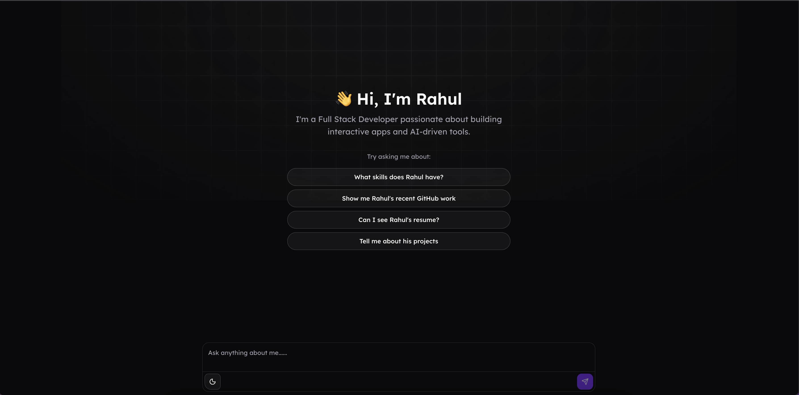

# 🤖 Rahul's AI Portfolio Assistant

An interactive AI-powered portfolio that helps visitors explore Rahul's skills, projects, experiences, education, and more — all through natural conversation.  
The assistant responds in a structured + conversational format, making it easy to showcase information dynamically.

## 🚀 Features
- 💬 AI Chatbot that answers questions about Rahul  
- 📂 Structured responses for Skills, Projects, Experiences, Education, Socials, Resume  
- 🎨 Modern UI with clean, minimal design  
- ⚡ Built with React, TypeScript, and Next.js  
- 🔗 Quick access to GitHub, LinkedIn, and other socials  

## 📦 Tech Stack
- **Frontend:** React, Next.js, TypeScript, TailwindCSS  
- **AI:** Custom system prompt + JSON structured responses  
- **Deployment:** Vercel  

## 🎯 Usage
Start a conversation by asking things like:
- _"What skills does Rahul have?"_  
- _"Can I see Rahul’s resume?"_  
- _"Tell me about his projects."_  

## 📜 License
MIT License
