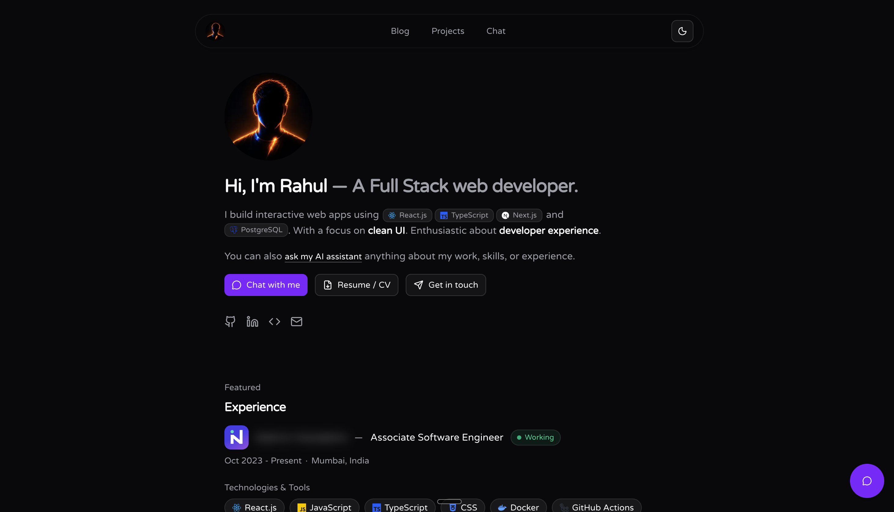

# Rahul Rana — Interactive AI Portfolio

This repository hosts an interactive portfolio built with Next.js and TypeScript that includes an AI-powered chat interface to explore projects, skills, experience, education, and more.

Live demo: https://rahul-bot.vercel.app/



## Key Features

- Conversational AI assistant for the portfolio (structured + natural responses)
- Browse projects, work experience, education, and social links via chat
- Rich MDX blog support with generated table-of-contents
- Theme switching and accessible components
- Small, focused component library in `components/` and `ui/`

## Project Structure (high level)

- `app/` — Next.js App Router pages and API routes
- `components/` — UI and feature components (chat, header, cards, etc.)
- `content/` — Structured content for profile, projects, blog, skills, experience
- `lib/` — helper utilities (MDX compilation, site URL, parsing)
- `assets/` & `public/` — icons, images, and static files
- `prompt/` — system prompt & AI configuration
- `types/` — shared TypeScript types

## Tech Stack

- Next.js (App Router)
- React + TypeScript
- Tailwind CSS
- Vercel for deployment

## Local Development

1. Install dependencies (uses pnpm):

```bash
pnpm install
```

2. Copy env template and add secrets (optional but needed for the contribution calendar):

```bash
cp .env.example .env.local
```

Set `GITHUB_TOKEN` in `.env.local` (see [GitHub token setup](#github-contribution-calendar) below). Without it, the Activity section shows a graceful fallback instead of the chart.

3. Run the dev server:

```bash
pnpm dev
```

4. Visit `http://localhost:3005`

Notes:

- Content for the site is driven from `content/` and MDX files under `content/blog/`.
- The chat assistant prompt and behavior live under `prompt/` and `lib/parse-message.ts`.

## GitHub contribution calendar

The homepage **Activity** section loads your real GitHub contribution graph via the GraphQL API.

1. Create a token at [GitHub → Settings → Developer settings → Personal access tokens](https://github.com/settings/tokens).
2. **Classic:** generate a personal access token (no scopes required for public contribution data).  
   **Fine-grained:** resource owner = your user; repository access can be “Public repositories”; permissions minimal (public profile is enough).
3. Local: put `GITHUB_TOKEN=ghp_...` in `.env.local` (never commit this file).
4. Production (Vercel): Project → Settings → Environment Variables → add `GITHUB_TOKEN` for Production (and Preview if you want).
5. Restart `pnpm dev` after adding the local token.

## Adding or Removing Assets

- Static assets live in `public/` (images, logos, PDFs). Component icons are under `assets/icons/`.
- If you remove an asset, search the codebase for references to its filename before deleting.

## Deployment

Deploy to Vercel (recommended). The site is configured for static and server-rendered pages via Next.js app router.

## Troubleshooting Link Previews

- To ensure social previews include the image, add Open Graph/Twitter metadata in `app/layout.tsx` and redeploy.
- Use platform validators to refresh caches:
  - Facebook Sharing Debugger: https://developers.facebook.com/tools/debug/
  - Twitter Card Validator: https://cards-dev.twitter.com/validator

## Contributing

- Open a PR with changes. Follow existing code style and TypeScript types.

## License

MIT
